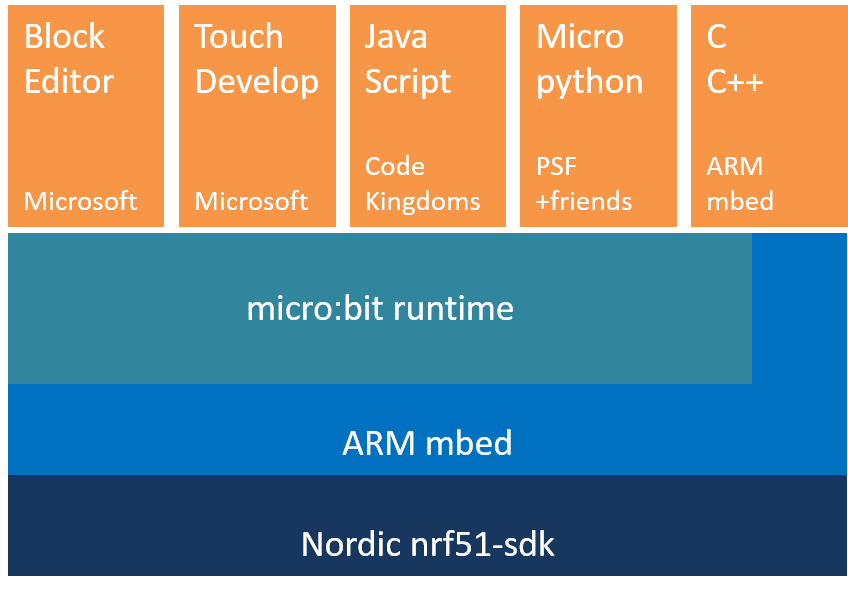
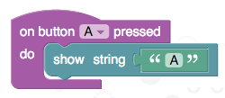

# Concepts

The micro:bit runtime provides an easy to use environment for programming the BBC micro:bit
in the C/C++ language. It contains device drivers for all the hardware capabilities of the micro:bit,
and also a suite of runtime mechanisms to make programming the micro:bit easier and more flexible. These
range from control of the LED matrix display to peer-to-peer radio communication and secure
Bluetooth Low Energy services. The micro:bit runtime is proudly built on the [ARM mbed](https://www.mbed.com)
and [Nordic nrf51](http://www.nordicsemi.com) platforms.

In addition to supporting development in C/C++, the runtime is also designed specifically to support
higher level languages provided by our partners that target the micro:bit. It is currently used as a support library for all the
languages on the BBC [www.microbit.co.uk](http://www.microbit.co.uk) website, including Microsoft Block Editor, Microsoft Touch Develop, Code Kingdoms
JavaScript and Micropython languages.




## A Component Based Approach
Whenever computer scientists tackle large programming problems, we take the time to split the problem into smaller,
independent sections to make the problem easier to solve (divide and conquer!).  The micro:bit runtime is no exception,
and is made up of a number of smaller components. Each of these components looks after
a specific job on the micro:bit.

Building up software like this helps us to write code in a way that is
much easier to maintain as the amount of code grows. For example, a component called [MicroBitDisplay](ubit/display.md)
controls the LEDs on the micro:bit, and lets the programmer show images, animations and messages. The
[MicroBitIO](ubit/io.md) component controls input and output through the pins on the edge of the device.

The micro:bit runtime is object oriented, with each component typically being a C++ class.
There are over 30 components making up the runtime, and they are documented on these pages.

To make the runtime as easy to use as possible, there is also a grouping of the most commonly used components in
an object called [uBit](ubit.md) (The 'u' being the greek letter mu - which often refers to 'micro' in scientific units!).

The uBit object can be used to easily access most of the functionality of the micro:bit. You can find the components
and functions that can be accessed this way in the `uBit` in the navigation bar.

To show just how easy it is to get started, the following code shows how you would write a traditional Hello World program.

This uses the uBit object to access the display component, then instructs the display to scroll the given string across
the LEDs. Try to use the `uBit` menu tab above to find the documentation for this scroll() function!

```cpp
uBit.display.scroll("Hello micro:bit!");
```

!!! note
    Did you know that you don't need to use the uBit object? Advanced users will likely prefer to create only the components they need to conserve memory on the device. See the [advanced](advanced.md) section for how to do this.


# Events
Computer programs execute sequentially - one line after another, following the logic of the program you have written.
Sometimes though, we want to be able to determine *when* something has happened, and write some code to decide what should
happen in that case.

For example, maybe you want to know when a button has been pressed, when your micro:bit has been shaken,
or when some data has been sent to you over the device's radio. For these sorts of cases, we create a [MicroBitEvent](data-types/event.md).


## Creating Events
Many components will raise events when interesting things occur. For example, ['MicroBitAccelerometer'](ubit/accelerometer.md) will raise events to indicate that the
micro:bit has be been shaken, or is in freefall and ['MicroBitButton'](ubit/button.md) will send events on a range of button up, down, click and hold events.
Programmers are also free to send their own events whenever they feel it would be useful. `MicroBitEvent`s are *very* simple, and consist of
only two numbers:

  - `source` - A number identifying the component that created the event.
  - `value` - A number unique to the source that identifies the event.

The documentation for each component defines its event source, and all the events it may generate, and also gives a name to these
event values. For example, take a look at the [button documentation](ubit/button.md) to see that the source MICROBIT_ID_BUTTON_A has the value '1',
and an event MICROBIT_BUTTON_EVT_CLICK with the value '3' is generated when a button is clicked.

Creating an event is easy - just create a MicroBitEvent with the `source` and `value` you need, and the runtime takes care of the rest:

```cpp
MicroBitEvent(MICROBIT_ID_BUTTON_A, MICROBIT_BUTTON_EVT_CLICK);
```

Feel free to create your own events lke this too. Just try to avoid using any source ID that is already used by the runtime! :-)
See the [messageBus](ubit/messageBus.md) page for a complete table of the reserved source IDs.


## Detecting Events
The micro:bit runtime has a component called the [`MicroBitMessageBus`](ubit/messageBus.md), and its job is remember which events your program is interested in, and
to deliver `MicroBitEvent`s to your program as they occur.

To find out when an event happens, you need to create a function in your program,
then tell the message bus which event you want to attach this function to. This is known as writing an **event handler**.

You write an event handler through the `MicroBitMessageBus` [listen](ubit/messageBus.md) function.  

```cpp
void onButtonA(MicroBitEvent e)
{
    uBit.display.print("A");
}

int main()
{
    uBit.messageBus.listen(MICROBIT_ID_BUTTON_A, MICROBIT_BUTTON_EVT_CLICK, onButtonA);
}
```

Now, whenever the MICROBIT_BUTTON_EVT_CLICK event is raise by MICROBIT_ID_BUTTON_A, your code inside function 'onButtonA' will be automatically executed.  

You can call listen as many times as you want to attached functions to each of the events that are useful for your program. In fact, a block like the
following in the Microsoft Block language translates into code just like that shown above when it is run on a micro:bit!




##Wildcard Events
Sometimes though, you want to capture all events generated by some component. For example, you might want to know when any changes in a button has happened.
In this case, there is a special event value called 'MICROBIT_EVT_ANY'. If you call listen with this value, then ALL events from the given source component will be delivered to your function.

You can find out which ones by looking at the `MicroBitEvent` delivered to your function - it contains the `source` and `value` variables that the `MicroBitEvent` was created with.

For example, you could write a program like this:
```cpp
void onButtonA(MicroBitEvent e)
{
    if (e.value == MICROBIT_BUTTON_EVT_CLICK)
        uBit.display.scroll("CLICK");

    if (e.value == MICROBIT_BUTTON_EVT_DOWN)
        uBit.display.scroll("DOWN");
}

int main()
{
    uBit.messageBus.listen(MICROBIT_ID_BUTTON_A, MICROBIT_EVT_ANY, onButtonA);
}
```

If you *REALLY* want even more events, there is also a MICROBIT_ID_ANY source, that allows you to attach a function to event generated from any component.

Use this sparingly though, as this could be quite a lot of events!

The following code would attach the `onEvent` function to receive all the events from the whole runtime:
```cpp
void onEvent(MicroBitEvent e)
{
    uBit.display.scroll("SOMETHING HAPPENED!");
}

int main()
{
    uBit.messageBus.listen(MICROBIT_ID_ANY, MICROBIT_EVT_ANY, onEvent);
}
```

## Queued Events

When you write an event handler, your function will be called each time the relevant event is raised. But what happens if your handler takes a long time to execute?

The example above will scroll "SOMETHING HAPPENED" whenever any event is raised... but scrolling that message will take several seconds to complete!

What if another event happens during this time?  By default, the runtime will queue any events for your event handler until it has finished what its already doing.

As soon as your handler is finished processing an event, the next one will be delivered (any other event handlers will be unaffected though - just because one event handler is busy, doesn't mean that another one can't receive its events!).

The runtime does allow you to change this behaviour if you want to though. See the advanced documentation in [MicroBitMessageBus](ubit/messageBus.md) for more details.

!!! note
    More advanced programmers might be interested to know that you can also attach event handler to member function of C++ objects. See the other forms of listen function in [MicroBitMessageBus](ubit/messageBus.md) for more details.


# Concurrency

It is not uncommon to want to write programs that can do more than one thing at a time. For example, it takes quite a long time to scroll a message over the LED matrix, so what if you want
your program to do something else while this is happening?

Programs that do more than one thing at a time are called **concurrent programs**.

The runtime provides two ways you can achieve concurrency in your programs:

 -  Functions that may take a very long time to complete (e.g. display.scroll) often have "Async" versions (e.g. `display.scrollAsync`).         

    These functions have the exact same behaviour as their counterparts, but don't wait for the effect to finish before allowing the user's program to continue.

    Instead, as soon as the function is called, the user's program carries on executing (and can go an do something else while the task is running in the background).


 - Users can also make use of the runtime fiber scheduler. This lets you run parts of your program in the background, and share the processor on your micro:bit between those parts
as they need it.

    In fact, whenever you write an event handler, the runtime will normally execute your handler in the background in this way, so that it reduces the impact on the rest of your program!

    The scheduler is a type of *non-preemptive scheduler*. This means that the runtime will never take control away from your program - it will wait for it to make a call to a runtime
function that is *blocking*.

    All the functions that are blocking are listed as such in their documentation.  You can create **fibers** at any time.
